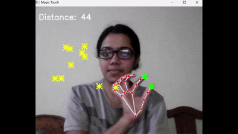

# MagicTouch ⭐

A fun computer vision project that lets you create stars in the air using hand gestures and a webcam.

Using OpenCV and MediaPipe, the application tracks hand movements in real time and detects a pinch gesture between the thumb and index finger. When a pinch is detected, a star is generated at that location on the screen.

## Features

* Real-time hand tracking
* Pinch gesture detection
* Star generation at fingertip position
* Webcam-based interaction

## Technologies

* Python
* OpenCV
* MediaPipe

## Run

```bash
pip install -r requirements.txt
python main.py
```

## Demo



Built for fun while exploring computer vision and gesture-based interactions.
